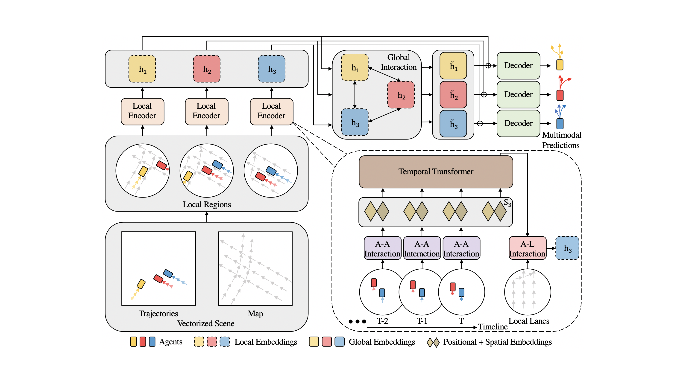
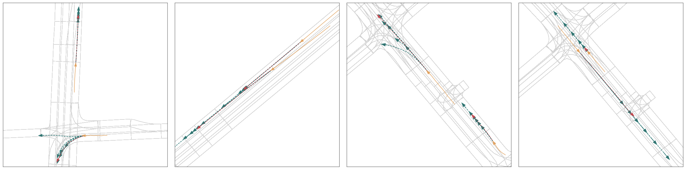

# HiVT: Hierarchical Vector Transformer for Multi-Agent Motion Prediction
This repository contains the official implementation of [HiVT: Hierarchical Vector Transformer for Multi-Agent Motion Prediction](https://openaccess.thecvf.com/content/CVPR2022/papers/Zhou_HiVT_Hierarchical_Vector_Transformer_for_Multi-Agent_Motion_Prediction_CVPR_2022_paper.pdf) published in CVPR 2022.



## Gettting Started

1\. Clone this repository:
```
git clone https://github.com/ZikangZhou/HiVT.git
cd HiVT
```

2\. Create a conda environment and install the dependencies:
```
conda create -n HiVT python=3.8
conda activate HiVT
conda install pytorch==1.8.0 cudatoolkit=11.1 -c pytorch -c conda-forge
conda install pytorch-geometric==1.7.2 -c rusty1s -c conda-forge
conda install pytorch-lightning==1.5.2 -c conda-forge
```

3\. Download [Argoverse Motion Forecasting Dataset v1.1](https://www.argoverse.org/av1.html). After downloading and extracting the tar.gz files, the dataset directory should be organized as follows:
```
/path/to/dataset_root/
├── train/
|   └── data/
|       ├── 1.csv
|       ├── 2.csv
|       ├── ...
└── val/
    └── data/
        ├── 1.csv
        ├── 2.csv
        ├── ...
```

4\. Install [Argoverse 1 API](https://github.com/argoai/argoverse-api).

## Training

To train HiVT-64:
```
python train.py --root /path/to/dataset_root/ --embed_dim 64
```

To train HiVT-128:
```
python train.py --root /path/to/dataset_root/ --embed_dim 128
```

**Note**: When running the training script for the first time, it will take several hours to preprocess the data (~3.5 hours on my machine). Training on an RTX 2080 Ti GPU takes 35-40 minutes per epoch.

During training, the checkpoints will be saved in `lightning_logs/` automatically. To monitor the training process:
```
tensorboard --logdir lightning_logs/
```

## Evaluation

To evaluate the prediction performance:
```
python eval.py --root /path/to/dataset_root/ --batch_size 32 --ckpt_path /path/to/your_checkpoint.ckpt
```

## Pretrained Models

We provide the pretrained HiVT-64 and HiVT-128 in [checkpoints/](checkpoints). You can evaluate the pretrained models using the aforementioned evaluation command, or have a look at the training process via TensorBoard:
```
tensorboard --logdir checkpoints/
```

## Results

### Quantitative Results

For this repository, the expected performance on Argoverse 1.1 validation set is:

| Models | minADE | minFDE | MR |
| :--- | :---: | :---: | :---: |
| HiVT-64 | 0.69 | 1.03 | 0.10 |
| HiVT-128 | 0.66 | 0.97 | 0.09 |

### Qualitative Results



## Citation

If you found this repository useful, please consider citing our work:

```
@inproceedings{zhou2022hivt,
  title={HiVT: Hierarchical Vector Transformer for Multi-Agent Motion Prediction},
  author={Zhou, Zikang and Ye, Luyao and Wang, Jianping and Wu, Kui and Lu, Kejie},
  booktitle={Proceedings of the IEEE/CVF Conference on Computer Vision and Pattern Recognition (CVPR)},
  year={2022}
}
```

## License

This repository is licensed under [Apache 2.0](LICENSE).

